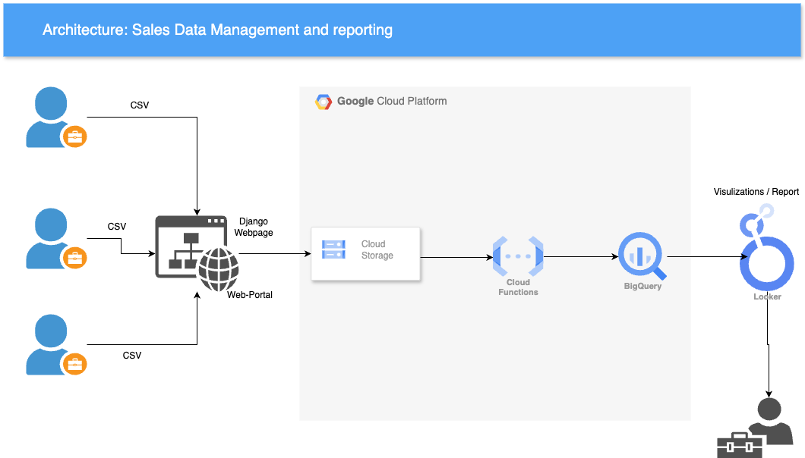

# Sales Data Web Portal

## Project Overview

- This project is designed to streamline the process of uploading sales data from various sources into a centralized data warehouse, making it easily accessible for data analysis and reporting. The web portal, built using Django, allows users to upload CSV files directly into a Google Cloud Storage bucket. The uploaded data is then automatically transferred to BigQuery using Cloud Functions, where it can be analyzed and visualized using tools like Looker Studio.

## Architecture

 
## Key Features

- Data Upload Portal: Developed a Django-based web interface for users to upload CSV files. The portal is accessible to authorized personnel and handles data from various sources.
- Automated Data Ingestion: Integrated Google Cloud Functions to automate the process of transferring uploaded data from the Cloud Storage bucket to BigQuery.
- Centralized Data Warehouse: Utilized BigQuery as the central data warehouse for storing sales data, enabling the data analyst team to access and analyze the data efficiently.
- Data Visualization: Enabled seamless integration with Looker Studio and other visualization tools to generate reports and insights from the sales data.

## Prerequisites
- Python 3.x and Django installed on your local machine.
- Google Cloud Platform account with access to Cloud Storage, BigQuery, and Cloud Functions.
- Access to the sales data in CSV format.

## Usage

- Data Upload: Authorized users can upload sales data through the web portal, which is then processed and stored in BigQuery automatically.
- Data Analysis: The data analyst team can directly access the centralized sales data in BigQuery for reporting and visualization.
